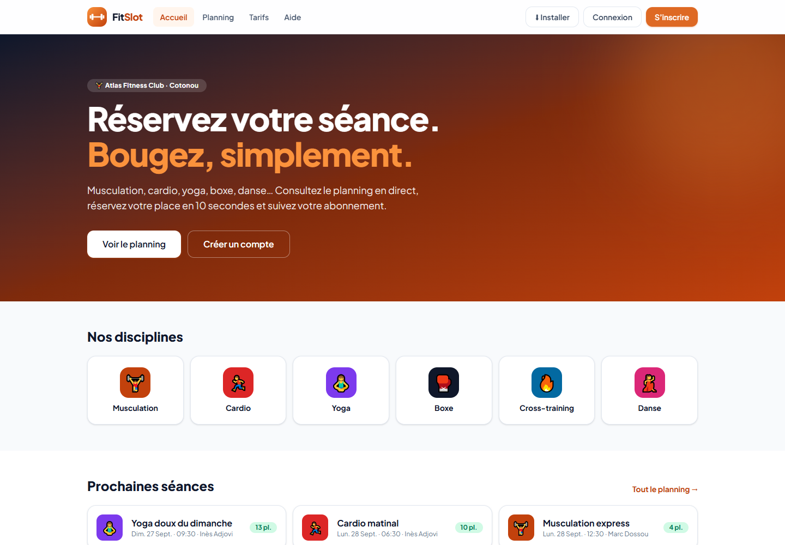
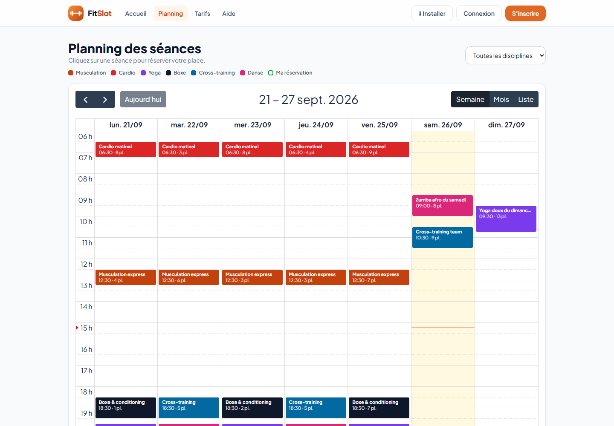
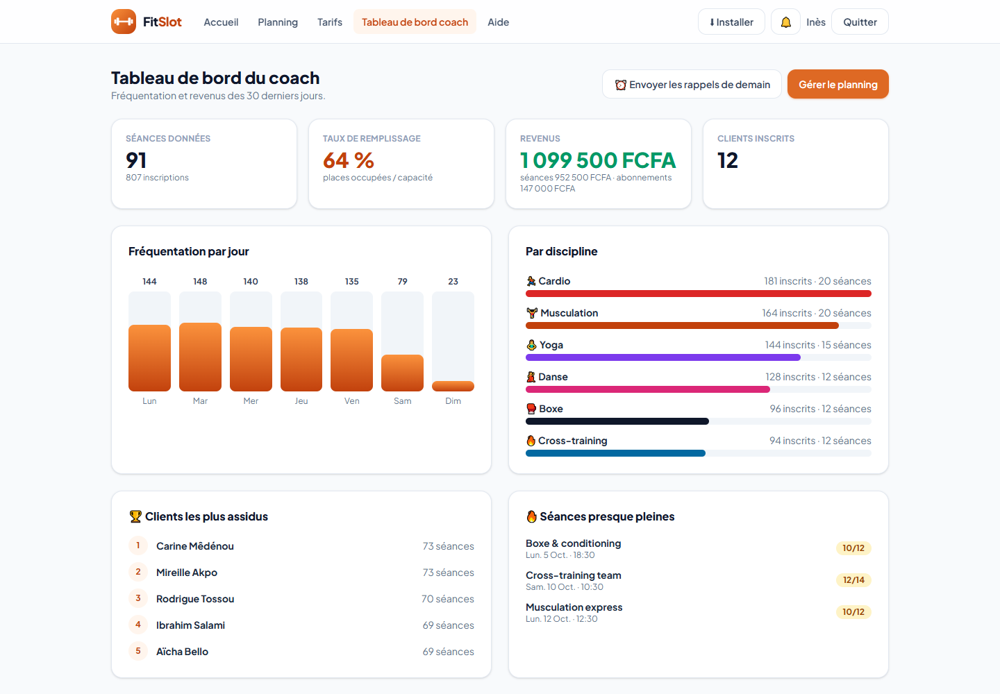
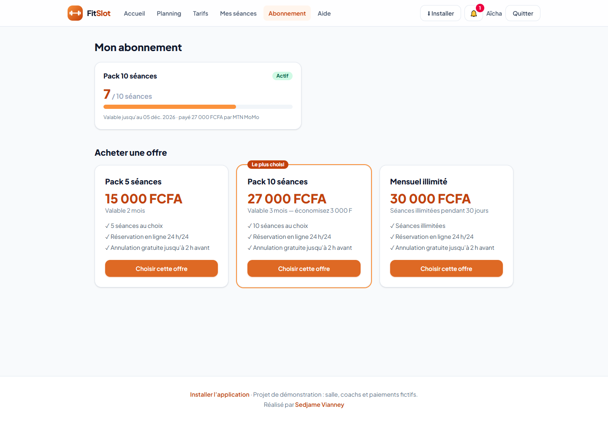

# FitSlot — Réservation de salle de sport et de coachs

Application permettant à une salle de sport ou à un coach indépendant de gérer ses créneaux, les réservations de ses
clients et le suivi de leurs abonnements. Projet n°6 du cahier des charges « 9 projets fictifs ».

**🔗 Démo en ligne :** https://mes-apps.wuaze.com/fitslot/ — **📲 Installer l’application** (mobile, tablette, ordinateur) : https://mes-apps.wuaze.com/fitslot/#/installer







## Fonctionnalités (MVP)

- Authentification : **coach** (admin) et **client**
- Gestion des créneaux sous forme de **calendrier** (FullCalendar) : création unique ou **répétée chaque semaine**
- Réservation d’un créneau par le client, avec limite de capacité et détection des doublons
- **Annulation ou report** d’une réservation (gratuits jusqu’à 2 h avant la séance)
- Vue calendrier côté coach : occupation de chaque séance, liste des inscrits, appel (présent / absent), annulation d’une séance
- **Notifications** de confirmation, d’annulation et de rappel (e-mails simulés, enregistrés dans l’application et le journal)

## Fonctionnalités avancées (bonus)

- **Paiement Mobile Money simulé** (MTN MoMo, Moov Money) pour une séance ou un abonnement
- **Abonnements** avec suivi du nombre de séances restantes : Pack 5, Pack 10, Mensuel illimité ; la séance est rendue en cas d’annulation
- **Rappels automatiques** de la veille : commande `php artisan fitslot:rappels` (planifiée à 18 h) et bouton dans l’espace coach
- **Statistiques de fréquentation** : taux de remplissage, revenus, jours et disciplines les plus suivis, clients assidus, séances presque pleines
- Application installable (PWA), interface adaptée mobile (vue liste sur téléphone)

## Guide utilisateur

**Client** — 1) créez votre compte ; 2) ouvrez le *Planning* et cliquez sur une séance ; 3) choisissez : abonnement, Mobile Money
ou paiement sur place ; 4) dans *Mes séances*, reportez ou annulez jusqu’à 2 h avant ; 5) achetez ou consultez votre
abonnement dans *Abonnement*. Un guide en ligne est aussi disponible dans l’application (page *Aide*).

**Coach** — 1) *Planning* → « Nouvelle séance » (ou clic sur un créneau libre), avec répétition hebdomadaire possible ;
2) cliquez sur une séance pour voir les inscrits et faire l’appel ; 3) *Tableau de bord coach* : statistiques et envoi des rappels.

## Stack

| Composant | Technologie |
|---|---|
| Backend / API | Laravel 12, Sanctum |
| Frontend | React 19 + Vite + Tailwind CSS 4 (dossier `frontend/`) |
| Calendrier | FullCalendar 6 |
| Base de données | MySQL |
| Documentation API | Collection Postman : [`docs/FitSlot.postman_collection.json`](docs/FitSlot.postman_collection.json) |

Modèle de données : `users (role, telephone)`, `creneaux`, `reservations`, `abonnements`, `notifications_app`.

## Installation

```bash
composer install
cp .env.example .env            # renseignez la base MySQL
php artisan key:generate
php artisan migrate --seed      # 2 coachs, 12 clients, 7 semaines de planning et des réservations
php artisan serve
```

L’interface est déjà compilée dans `public/spa` (`cd frontend && npm install && npm run build` pour la modifier).
Tests : `php artisan test` (12 tests : capacité, abonnement, paiement, annulation, report, récurrence, rappels).

## Comptes de démonstration

| Rôle | E-mail | Mot de passe |
|---|---|---|
| Coach | `coach@fitslot.bj` | `demo1234` |
| Cliente (Pack 10 entamé) | `client@fitslot.bj` | `demo1234` |

Salle, personnes et paiements fictifs.

Auteur : [Sedjame Vianney](https://sedjame-vianney.vercel.app)
